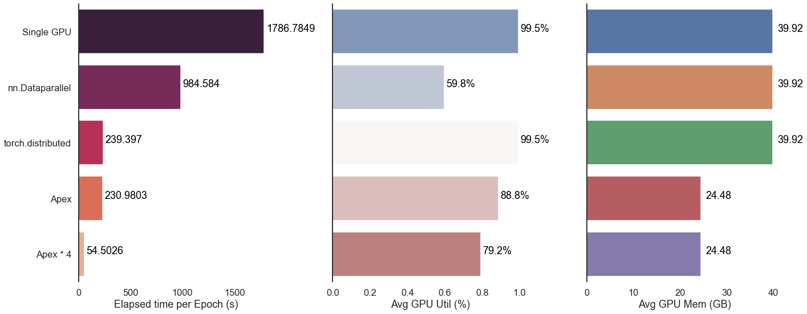

# PyTorch Distributed Test on High-Flyer AIHPC

We test the different implementations of PyTorch distributed training, and compare the performances.

+ single GPU
+ [nn.DataParallel](https://pytorch.org/docs/stable/generated/torch.nn.DataParallel.html)
+ [torch.distributed + torch.multiprocessing](https://pytorch.org/docs/stable/distributed.html#:~:text=Otherwise%2C%20torch.distributed%20does%20not%20expose%20any%20other%20APIs.,USE_DISTRIBUTED%3D1%20for%20Linux%20and%20Windows%2C%20USE_DISTRIBUTED%3D0%20for%20MacOS.)
+ [Apex](https://github.com/NVIDIA/apex)

We recommend that users use `Apex` to conduct distributed training on High-Flyer AIHPC.


## Dataset
**ImageNet**. We use [ffrecord](https://github.com/HFAiLab/ffrecord) to aggregate the scattered files on High-Flyer AIHPC.
```
train_data = '/public_dataset/1/ImageNet/train.ffr'
val_data = '/public_dataset/1/ImageNet/val.ffr'
```

## Test Model
ResNet
```
torchvision.models.resnet50()
```


## Parameters
+ batch_size: 400
+ num_nodes： 1
+ gpus： 8


## Results



## Summary
1. `Apex` is the most effective implementation to conduct PyTorch distributed training for now.
2. The acceleration effect is basically the same as the number of GPU.
3. The deeper the degree of parallelism, the lower the utilization of GPU.
